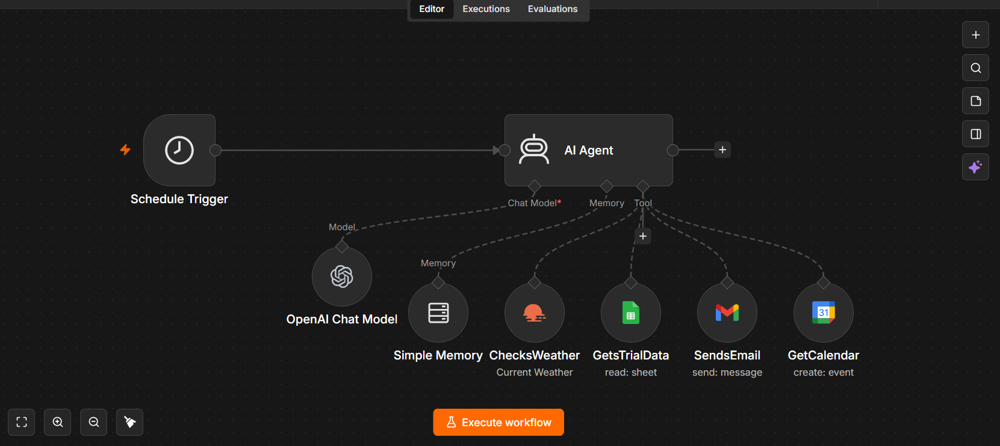

# 🥾 Personal Hiking Assistant
# 🥾 Personal Hiking Assistant


An AI-powered hiking assistant built with n8n, OpenAI, Google Sheets, Gmail, and Google Calendar.

An AI-powered hiking assistant built with **n8n**, **OpenAI**, **Google Sheets**, **Gmail**, and **Google Calendar**.

---

## 📌 Project Overview

The Personal Hiking Assistant automates hiking trip planning by combining AI with Google Workspace tools. It provides personalized recommendations, checks weather conditions, reads trail information, schedules events, and sends emails—all from a single n8n workflow.

## 🏗 Workflow Overview

This is the complete n8n workflow powering the Personal Hiking Assistant.



---

## ✨ Features

- 🤖 AI-powered hiking assistant
- 🌤️ Live weather checking
- 📊 Reads hiking trail information from Google Sheets
- 📅 Creates Google Calendar events
- 📧 Sends personalized hiking recommendation emails
- 🧠 Conversation memory
- ⚡ Fully automated n8n workflow

---

## 🛠️ Tech Stack

- n8n
- OpenAI GPT
- Google Sheets API
- Gmail API
- Google Calendar API

---

## 🔄 Workflow

```text
User
   │
   ▼
AI Agent
   │
   ├── Weather Check
   ├── Google Sheets
   ├── Gmail
   ├── Calendar
   └── Memory
```

---

## 🚀 Installation

1. Import `workflow.json` into n8n.
2. Configure OpenAI credentials.
3. Configure Google credentials.
4. Activate the workflow.
5. Test the assistant.

---

## 📄 License

MIT
